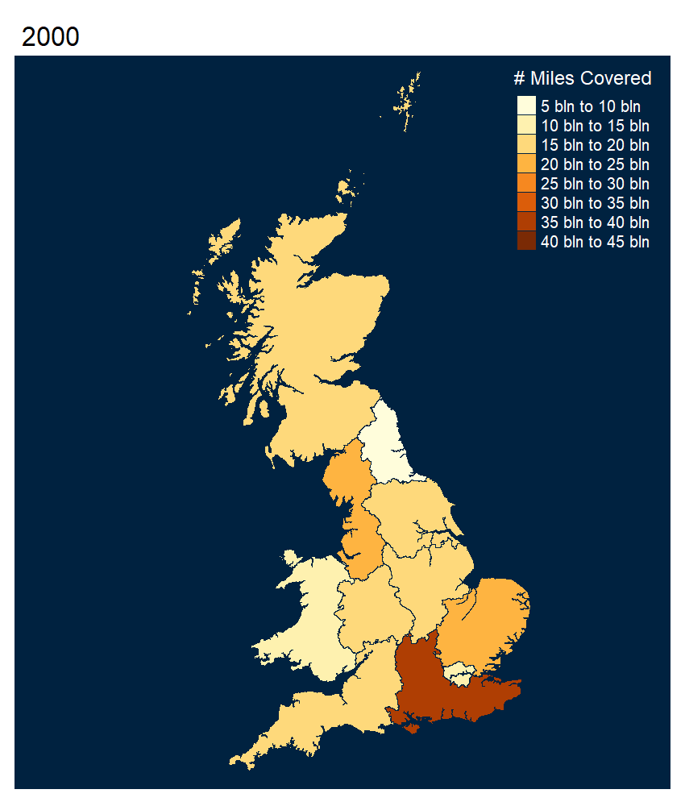
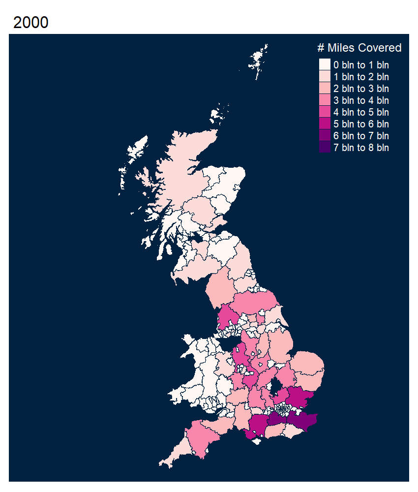
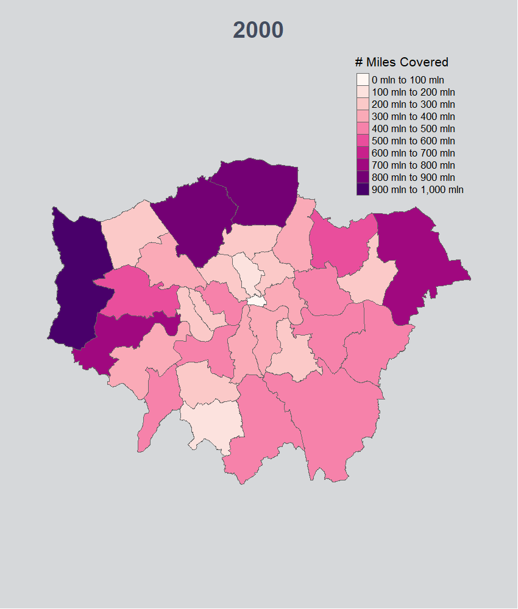
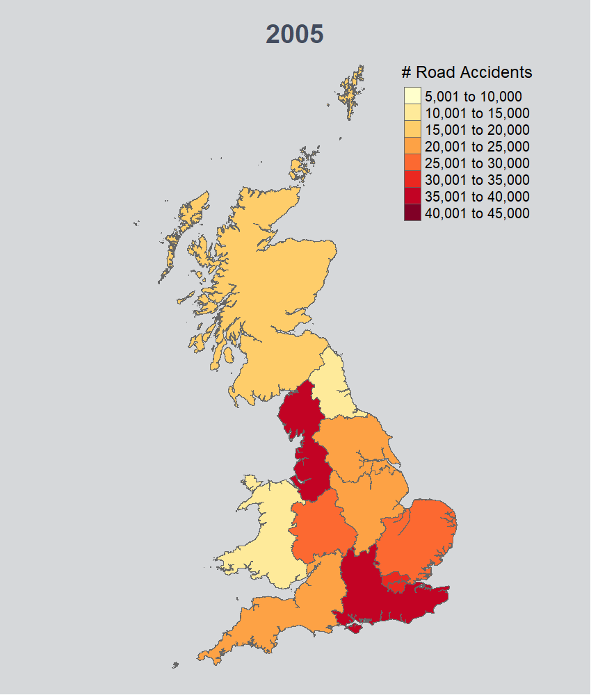
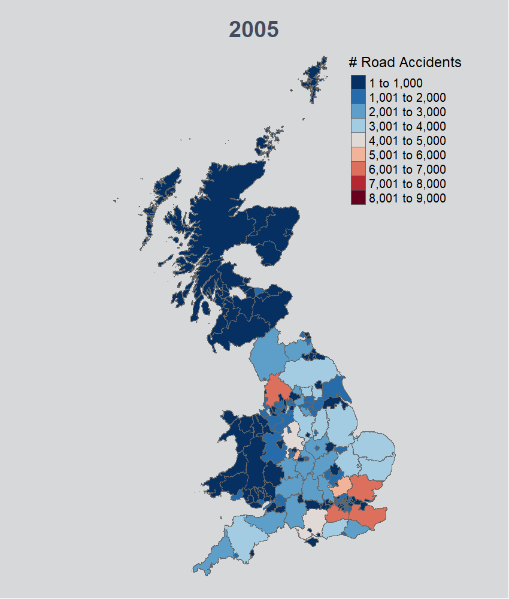
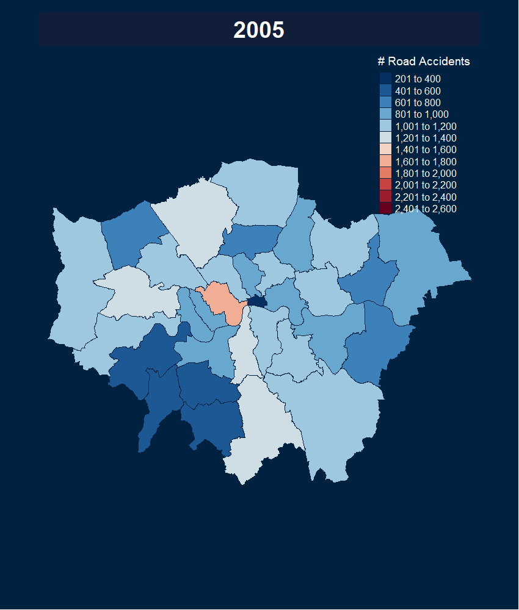

[//]: # (Image References)

[image3]: ./uk_shape_file/uk_reg_traffic_animation2.gif "region_traffic_animation"
[image1]: ./uk_shape_file/uk_traffic_lad_animation2.gif "lad_traffic_animation"
[image2]: ./uk_shape_file/uk_traffic_lond_animation.gif "london_traffic_animation"
[image4]: ./uk_shape_file/uk_reg_acc_animation2.gif "region_accident_animation"
[image5]: ./uk_shape_file/uk_lad_acc_animation.gif "lad_accident_animation"
[image6]: ./uk_shape_file/uk_lond_acc_animation2.gif "london_accident_animation"

# UK-Road-Accident-Traffic-Analytics-with-RShiny
This is an Analytics project that give insights into UK Road accident &amp; Traffic data using RShiny Dashboard.


This project will give detailed insights into United Kingdom (UK) long-term road traffic and accident trends between 2000 - 2018  based on estimated Annual average daily flows (AADFs) and volume of traffic (i.e. miles driven per year for each vehicle on a particular road) for vehicle types, road networks/types, geographical regions, and highway authorities in UK.


### - N.B: It takes about 8 - 10 minutes for the RShiny Dashboard to load, because of the size of the maps rendered
-----------------------------------------------------------------------------------------------------------------------
## [RShiny Dashboard link](https://r2p6eu-adeniyi-adeboye.shinyapps.io/shinyyapp/?_ga=2.87322008.1664107995.1638545186-1694532827.1638545186)


### - Tmap Generated GIF maps 

#### - Example code
```
uk_traffic_lad_animation <- tm_shape(uk_lad_shp_map_all_vehs) +
  tm_polygons(col = "avg_traffic_flow", palette =colorRampPalette(brewer.pal(10,"RdPu"))(8), n = 8,
              title = "# Miles Covered") +
tm_facets(along = "year") + tm_style("cobalt") + tm_layout(
    legend.text.size = 1.2, legend.position = c("right", "top"),
    legend.title.size = 1.7, main.title.size = 2.0,
    legend.height = 0.3)
tmap_animation(
  uk_traffic_lad_animation, filename = "uk_shape_file/uk_traffic_lad_animation2.gif",
  delay = 75, width = 850, height = 1000
  )
```

#### - UK & London Road Traffics Map Gifs

<p float="left">
  
  
  
</p>


#### - UK & London Road Accidents Map Gifs

<p float="left">
  
  
  
</p>

